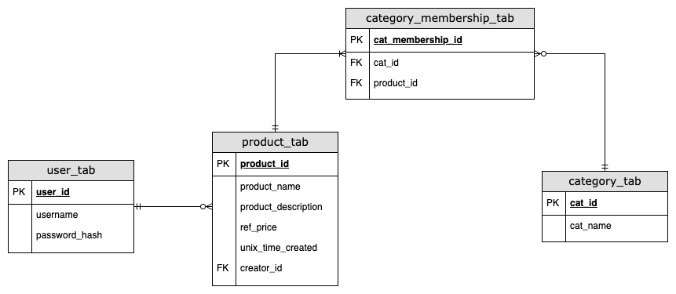

# Database design

Database design supports the requirements:
1. User login
2. Product is a member of at least one category
3. Search by products made by user
4. Search by products under a category
5. Display product details

There is many-to-many relationship between product and category. To avoid violating 1st normal form, a membership table is used.
## User Table
```sql
CREATE TABLE tcp_auth_db.user_tab(
    user_id BIGINT AUTO_INCREMENT PRIMARY KEY,
    username VARCHAR(64),
    password VARCHAR(72)
);

CREATE UNIQUE INDEX idx_username
    ON tcp_auth_db.user_tab(username);
```

## Product Table
```sql
CREATE TABLE http_bff_db.product_tab(
    product_id BIGINT AUTO_INCREMENT PRIMARY KEY,
    product_name VARCHAR(128),
    product_description TEXT,
    ref_price BIGINT,
    unix_time_created BIGINT,
    creator_id VARCHAR(64) # enforce in backend logic
);

CREATE FULLTEXT INDEX idx_product_name
ON http_bff_db.product_tab(product_name);

CREATE INDEX idx_creator_id
ON http_bff_db.product_tab(creator_id);

CREATE INDEX idx_ref_price
ON http_bff_db.product_tab(ref_price);
```
## Category Table
```sql
CREATE TABLE http_bff_db.category_tab(
    cat_id BIGINT AUTO_INCREMENT PRIMARY KEY,
    cat_name VARCHAR(128)
);
```
## Category Membership Table
```sql
CREATE TABLE http_bff_db.category_membership_tab(
    cat_membership_id BIGINT AUTO_INCREMENT PRIMARY KEY,
    cat_id BIGINT,
    product_id BIGINT
);

CREATE INDEX idx_cat_id
ON http_bff_db.category_membership_tab(cat_id);

CREATE INDEX idx_product_id
ON http_bff_db.category_membership_tab(product_id);
```